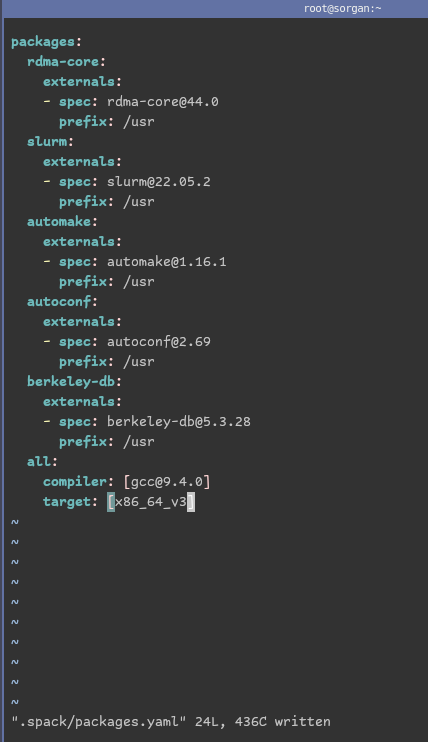

# Spack → micro archs, compatibility

for spack to work with all nodes, we must NOT target microarchtetures…

[https://spack.readthedocs.io/en/latest/build_settings.html](https://spack.readthedocs.io/en/latest/build_settings.html)

`concretizer.yaml`

.spack/concretizer.yaml

```jsx
[root@sorgan ~]# cat .spack/concretizer.yaml 
concretizer:
  targets:
    # Determine whether we want to target specific or generic
    # microarchitectures. Valid values are: "microarchitectures" or "generic".
    # An example of "microarchitectures" would be "skylake" or "bulldozer",
    # while an example of "generic" would be "aarch64" or "x86_64_v4".
    granularity: generic
```

update to spacks .yaml

some old nodes require more than generic. dell nodes require generic v3, not v4…

you can check the value with spack arch -g or something like that

you can set that in packages.yaml

