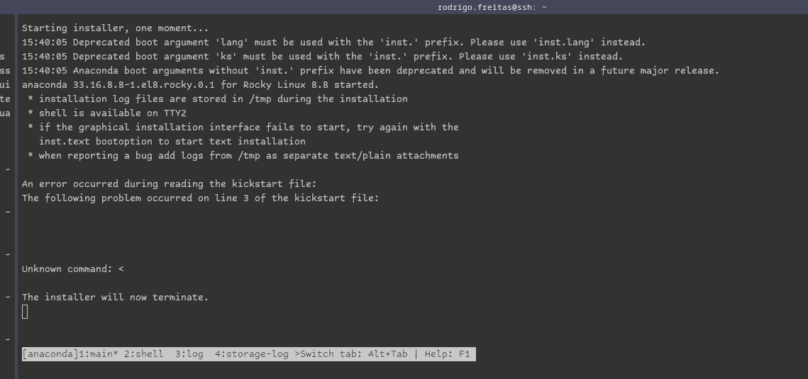

# Our Steps

- Setting boot device to bios

```bash
ipmitool -I lanplus -H 10.68.117.100 -U ADMIN -P BRCl0ud== chassis bootdev bios
```

Or infinit delet press

- cobbler

```bash
cobbler signature update

```

### Kickstart file (base)

```bash
#version=RHEL8
# Use graphical install
graphical

repo --name="Minimal" --baseurl=file:///run/install/sources/mount-0000-cdrom/Minimal

%packages
@^server-product-environment
kexec-tools

%end

# Keyboard layouts
keyboard --xlayouts='us'
# System language
lang en_US.UTF-8

# Network information
network  --bootproto=dhcp --device=enp1s0 --ipv6=auto --activate
network  --hostname=localhost.localdomain

# Use CDROM installation media
cdrom

# Run the Setup Agent on first boot
firstboot --enable

ignoredisk --only-use=vda
autopart
# Partition clearing information
clearpart --none --initlabel

# System timezone
timezone America/New_York --isUtc

# Root password
rootpw --iscrypted $6$jRZ6.DWWLADHoiwS$VW92WsEVcmag85Ag43TWMSlf4Yfx89ICmHQRZNMVHaMdEODel0amhDLE1O1LXKUKZc/o67JJjY3R2/wcBSlSP/

%addon com_redhat_kdump --enable --reserve-mb='auto'

%end

%anaconda
pwpolicy root --minlen=6 --minquality=1 --notstrict --nochanges --notempty
pwpolicy user --minlen=6 --minquality=1 --notstrict --nochanges --emptyok
pwpolicy luks --minlen=6 --minquality=1 --notstrict --nochanges --notempty
%end
```

### Kickstart (edited)

```bash
#version=RHEL8

# Install OS instead of upgrade
install

# Do not use graphical install
text

# Firewall configuration
firewall --enabled --service=ssh
firstboot --disable
ignoredisk --only-use=sda,nvme0n1

repo --name="Minimal" --baseurl=file:///run/install/sources/mount-0000-cdrom/Minimal

%packages
@^server-product-environment
kexec-tools

%end

# Keyboard layouts
keyboard --xlayouts='us'
# System language
lang en_US.UTF-8

# Network information
network  --bootproto=dhcp --device=eth0 --activate
network  --hostname=localhost.localdomain
# Reboot after installation
reboot

# Use network installation
url --url="http://deployment.lsc.ic.unicamp.br/cblr/links/rocky-8-x86_64/"

# Root password
rootpw --iscrypted $1$LYWZuKAR$/xdc3/tuCoD4Op5.lEow4/

# SELinux configuration
selinux --permissive
# System services
services --enabled="sshd,chronyd"
# Do not configure the X Window System
skipx
# System timezone
timezone America/Sao_Paulo --isUtc --ntpservers=ntp.lsc.ic.unicamp.br

# System bootloader configuration
bootloader --append=" crashkernel=auto" --location=mbr --boot-drive=sda
autopart --type=plain

# Clear the Master Boot Record
zerombr

# Partition clearing information
clearpart --all --initlabel

%addon com_redhat_kdump --enable --reserve-mb='auto'

%end

%anaconda
pwpolicy root --minlen=6 --minquality=1 --notstrict --nochanges --notempty
pwpolicy user --minlen=6 --minquality=1 --notstrict --nochanges --emptyok
pwpolicy luks --minlen=6 --minquality=1 --notstrict --nochanges --notempty
%end
```

### RockySeed

```bash
cat rocky_8_lsc.seed 
# install OS instead of upgrade
install

# The presently available methods are:
ignoredisk --only-use=nvme0n1

url --url="http://deployment.lsc.ic.unicamp.br/cblr/links/rocky-8-x86_64/"

# text mode installation
text

# system keyboard
keyboard us

# sets language, country and locale
lang en_US.UTF-8

# setup network interfaces via DHCP
network --device=eth0 --bootproto=dhcp --onboot=yes --activate

# root account and password
rootpw --iscrypted \$1\$LYWZuKAR\$/xdc3/tuCoD4Op5.lEow4/
 
# ntp/time setup
timezone America/Sao_Paulo --isUtc --ntpservers=ntp.lsc.ic.unicamp.br

# SELinux configuration
selinux --permissive
 
# clear the Master Boot Record
zerombr

# System bootloader configuration
bootloader --location=mbr --boot-drive=nvme0n1

# Partition clearing information
clearpart --all --initlabel --drives=nvme0n1 

# Disk partitioning information
part /boot/efi --fstype="efi" --ondisk=nvme0n1 --size=512 --fsoptions="umask=0077,shortname=winnt"
part / --fstype="xfs" --ondisk=nvme0n1 --size=200000
part swap --fstype="swap" --ondisk=nvme0n1 --size=58192
part /boot --fstype="xfs" --ondisk=nvme0n1 --size=512

# system services
services --enabled="chronyd"
services --enabled=sshd

# firewall configuration
firewall --enabled --service=ssh

# package configuration
%packages
@core
%end
%addon com_redhat_kdump --disable --reserve-mb='auto'

%end

# post install script
%post --log=/var/log/cobbler/install.log

yum install -y authconfig
yum install -y wget
yum install -y vim
yum install -y python
yum install -y curl
yum install -y openssh-server
yum install -y openssh-clients
yum install -y ntp

$SNIPPET('kickstart_start')

## public key for root user
cd /root
mkdir --mode=700 .ssh
cat >> .ssh/authorized_keys << "PUBLIC_KEY"
ssh-rsa AAAAB3NzaC1yc2EAAAADAQABAAACAQC8/Kn8pRlZkFssr8535mW0LCTL3eY9sNX0W4u9HEEQ6W60YEo0YkCilCKSvEVLLLZnCqJuMoCUtKWXvZ7EO+/N7U1ssCCekHYF/o5OEx/cB0ngfNxaYqCG/bCTVa/ytHVsrO2S8A/pvD0bI4J065wN3AZkXvt5U9kbccsAk8DTgjO78XdlIJIbzKWt1hFl9vEmknM0VTyfnUgfU+IPnZ3pcdiQc+pmbnrRc1u4z8u5c1GICSHWRx9yttXcq4pEyoVMQNZevu2Q4cdK2XQERNLnN9FyzLJ++fcKfRayEOM2YO0kYoCLK61XQA0U/RjN/aPdrM1JX9oaG1bOsAUflE6X+MBu0KdPjOqk4d/VMB/zyx473fJCZ62ymEmLxLpYw8FqR1xwURd5NXF1lU6Dy8ZyXv3PldL25OYtu35ol1/iHLB86K4vyzuJHvKnLyK8qoOSPssKhKRoWyMkMuuvSL6PzbcImY16j2hSvA6kA0lo0NWWjNEGasTIecxyzMI/NP8wIh7LnB8l73wJUTck4QZhapdPj9d45lJfgJr0N1AJSyZ4L4+mostOUgy0cjNAfluUEmYulDophLFYHlZbtfLcIY/Aq7W7EyIU0Smmc5Mac6tzhKUvpiCMyutAikKP8rIM1wWDrXzGxjXD+OXrlhA89rtfIr7B2lrd9PRapYxpJw== root@ansible
PUBLIC_KEY
chmod 600 .ssh/authorized_keys

$SNIPPET('kickstart_done')

%end

# reboot after install
reboot
```

### Editing Cobbler

```bash

cobbler profile edit --name=rocky-8-x86_64  --kickstart=/var/lib/cobbler/kickstarts/rocky_8_lsc.seed
cobbler profile edit --name=rocky-8-x86_64  --kopts="inst.text=~ inst.repo=http://deployment.lsc.ic.unicamp.br/cblr/ks_mirror/rocky-8-x86_64/ console=ttyS1,115200 devfs=nomount edd=off"
```

### Old sorgan system cobbler

```bash
cobbler system report --name=sorgan
Name                           : sorgan
TFTP Boot Files                : {}
Comment                        : 
Enable gPXE?                   : <<inherit>>
Fetchable Files                : {}
Gateway                        : 
Hostname                       : sorgan
Image                          : 
IPv6 Autoconfiguration         : False
IPv6 Default Device            : 
Kernel Options                 : {}
Kernel Options (Post Install)  : {}
Kickstart                      : <<inherit>>
Kickstart Metadata             : {}
LDAP Enabled                   : False
LDAP Management Type           : authconfig
Management Classes             : <<inherit>>
Management Parameters          : <<inherit>>
Monit Enabled                  : False
Name Servers                   : []
Name Servers Search Path       : []
Netboot Enabled                : False
Owners                         : <<inherit>>
Power Management Address       : 
Power Management ID            : 
Power Management Password      : 
Power Management Type          : ipmitool
Power Management Username      : 
Profile                        : centos-7-x86_64
Internal proxy                 : <<inherit>>
Red Hat Management Key         : <<inherit>>
Red Hat Management Server      : <<inherit>>
Repos Enabled                  : False
Server Override                : <<inherit>>
Status                         : production
Template Files                 : {}
Virt Auto Boot                 : <<inherit>>
Virt CPUs                      : <<inherit>>
Virt Disk Driver Type          : <<inherit>>
Virt File Size(GB)             : <<inherit>>
Virt Path                      : <<inherit>>
Virt PXE Boot                  : 0
Virt RAM (MB)                  : <<inherit>>
Virt Type                      : <<inherit>>
Interface =====                : eno1
Bonding Opts                   : 
Bridge Opts                    : 
CNAMES                         : []
InfiniBand Connected Mode      : False
DHCP Tag                       : 
DNS Name                       : 
Per-Interface Gateway          : 
Master Interface               : 
Interface Type                 : 
IP Address                     : 10.68.107.100
IPv6 Address                   : 
IPv6 Default Gateway           : 
IPv6 MTU                       : 
IPv6 Prefix                    : 
IPv6 Secondaries               : []
IPv6 Static Routes             : []
MAC Address                    : ac:1f:6b:5a:15:e8
Management Interface           : False
MTU                            : 
Subnet Mask                    : 
Static                         : False
Static Routes                  : []
Virt Bridge                    :
```

```bash
cobbler system edit --name=sorgan --profile=rocky-8-x86_64
```



[LDAP - Setting up manually](guides/LDAP_Setting_up_manually.md)

[Setting up the headnode with OPHC](guides/Setting_up_the_headnode_with_OPHC.md)

[Boot without interaction](guides/Boot_without_interaction.md)

[Spack Installation](guides/Spack_Installation.md)

[UCX + IB on SPACK](guides/UCX+IB_on_SPACK.md)

[Spack compatibility with ZSH](guides/Spack_compatibility_with_ZSH.md)

[Spack Missing modules in GPU node](guides/Spack_Missing_modules_in_GPU_node.md)

[PXE with Dell nodes](guides/PXE_with_Dell_nodes.md)

[NVIDIA missing in GPU nodes](guides/NVIDIA_missing_in_GPU_nodes.md)

[Spack → micro archs, compatibility](guides/Spack_micro_archs_compatibility.md)

[Spack Install list](guides/Spack_Install_list.md)