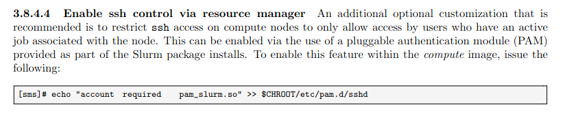

=== "Description"
    Problem: any user can SSH to any Sorgan node, even if the user has not allocated jobs.

    Solution: set-up PAM configuration on SSHD so that only users with running jobs can SSH to node

    

=== "To Do"

    - [ ] Setup and test PAM ssh on sorgan-gpu1 (see figure for instruction)
    - [ ] Update VNFS build (Ansible roles) to use this config
        - After step above, so we know that it works
        - Remember to update both Compute and Gpu nodes
    - [ ] Build and reboot nodes